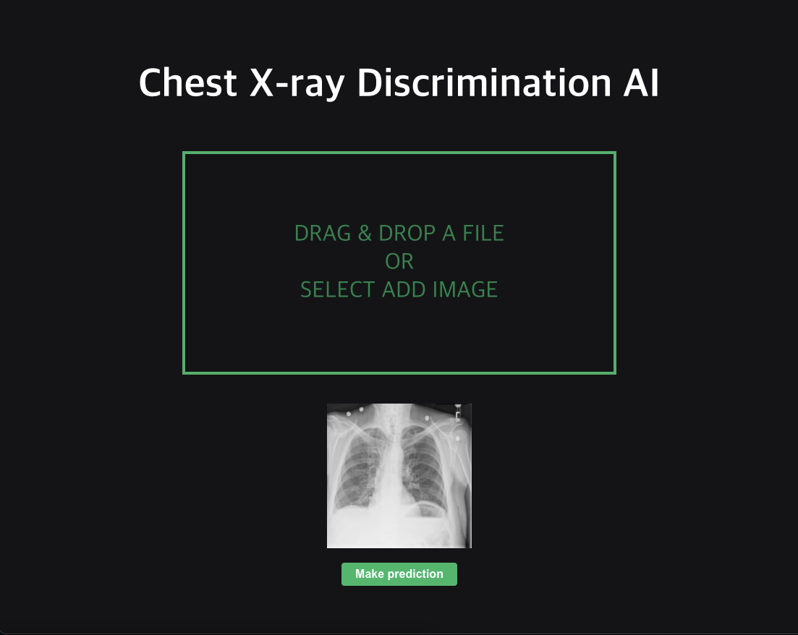
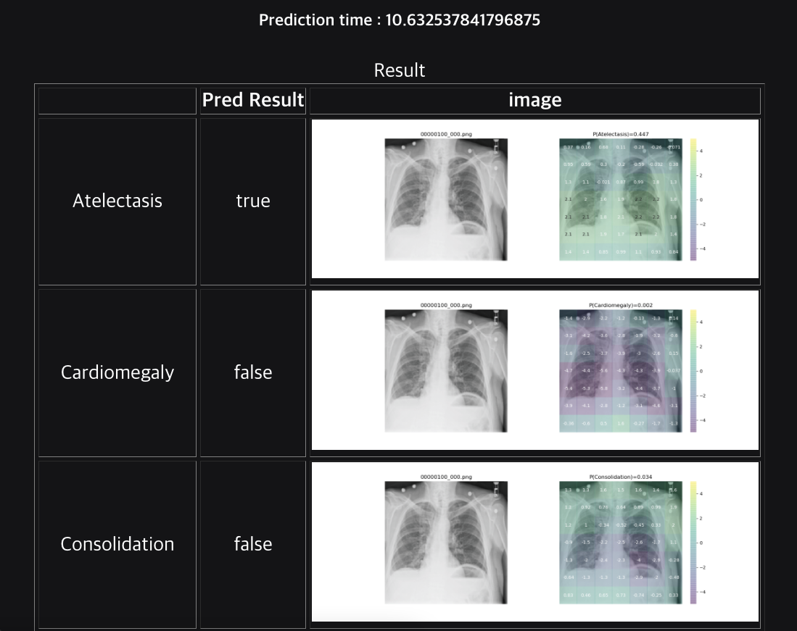
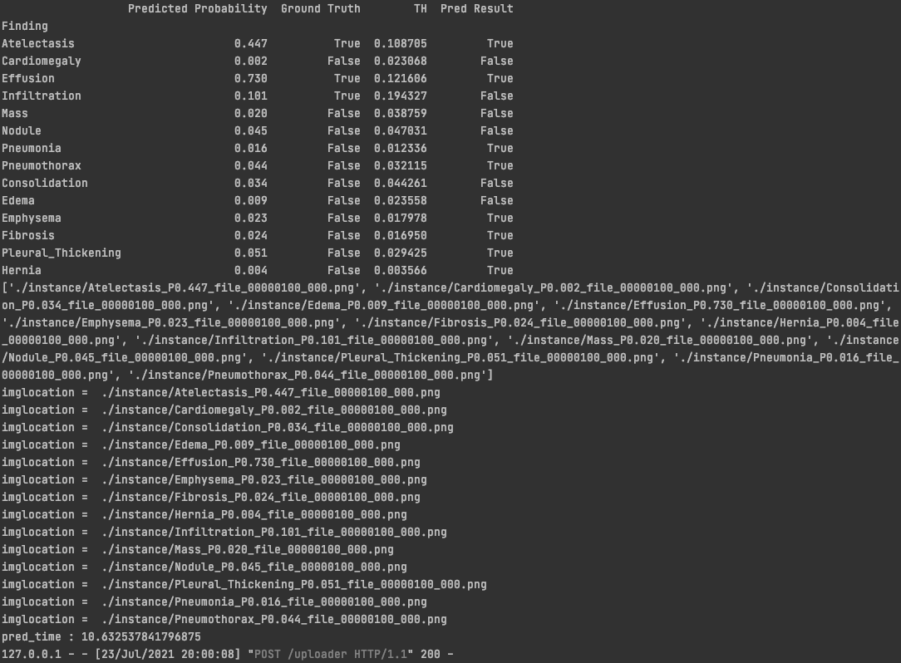

# Chexnet webapp

## Before change
A webapp implementation using react, pytorch and flask of chexnet.


## How to run frontend
```bash
cd frontend
npm install
npm start
```

## How to create backend environment
```bash
cd backend
conda env create -f environment.yml
source postBuild
source activate reproduce-chexnet
```

## How to run backend
```bash
export FLASK_APP=predict.py
flask run
```
The server is now running on localhost:5000


## After change
The existing code had several problems.
An error occurred such as a result not showing properly, an error depending on the version, or a gui issue.
This problem was solved and the results were displayed as multi-classification.

### Frontend 

webpage - home


webpage - multi classification

If you load Main Component in frontend/src/index.js, you can see the changed page.

### Backend

server - classification result

Multi-classification is possible by calling the V.multi_show_next function in backend/predict.py.

#### error resolution
1. Fix torch and torchvision version issues
2. Fix the problem that plt is called as gui environment
